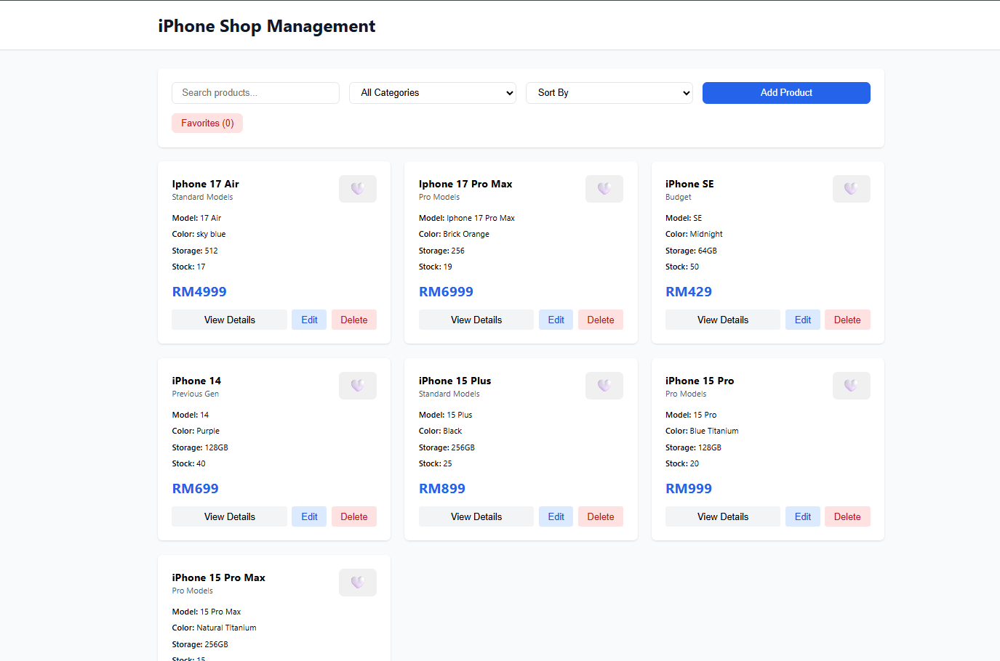
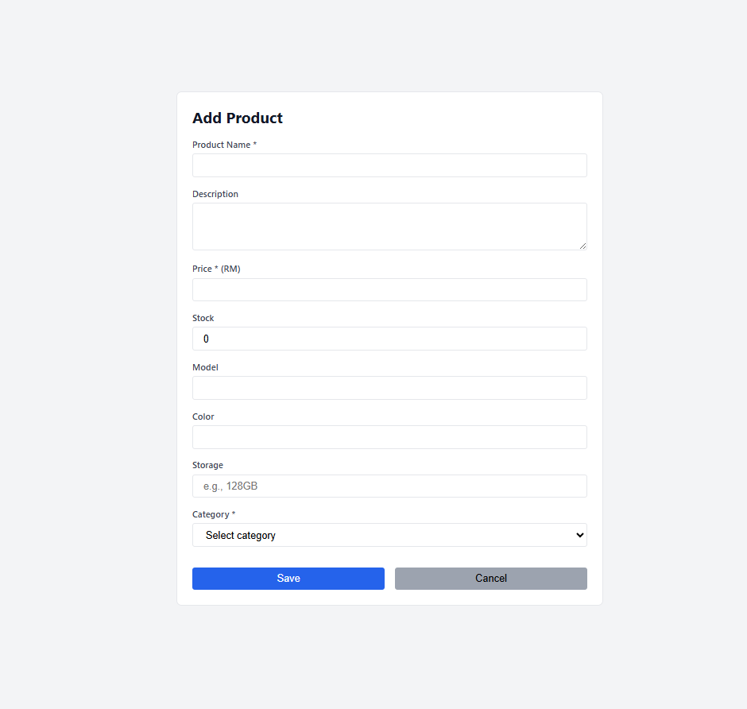
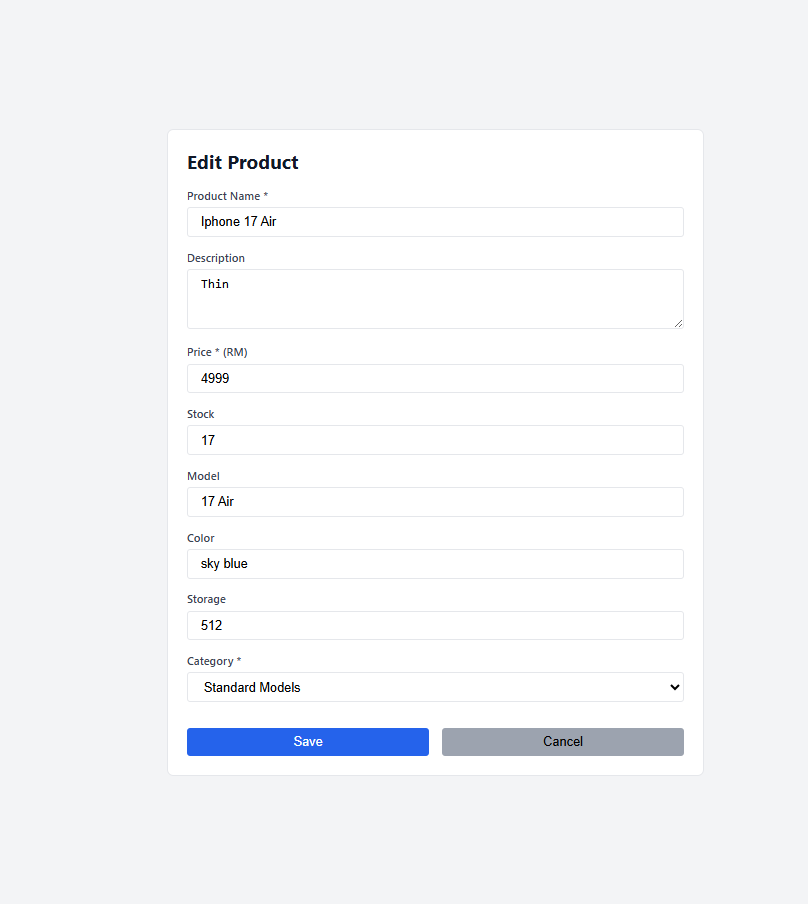
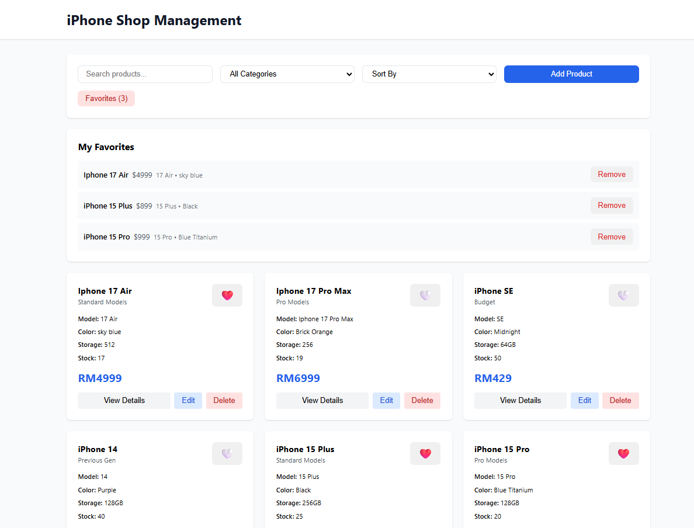
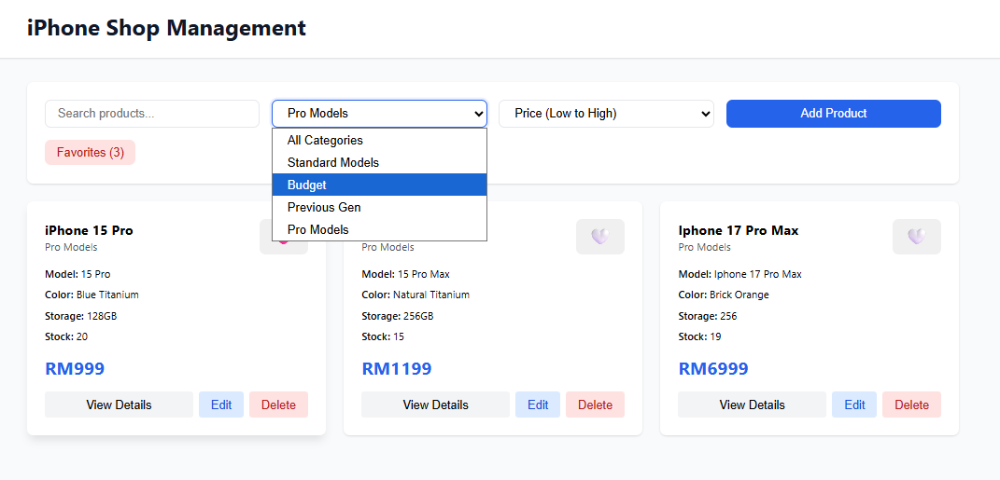
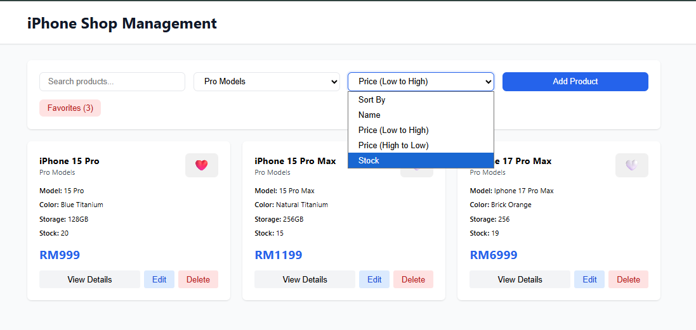

# Simple Listing Web Application

## Task Overview

This project is a full-stack web application built to demonstrate the ability to develop a functional item listing system. The main goal is to implement core technical functionality using modern technologies.

---

## Features

- **Item Listing** – Display a list of items with basic details.
- **Item Details** – View detailed information for each item upon selection.
- **Search & Sort** – Search for items and sort results by different criteria.
- **Categorization** – Filter items by categories.
- **Favorites** – Add or edit a list of favorite items.

---

## Technology Stack

- **Frontend:** ReactJS  
- **Backend:** Ruby on Rails with GraphQL API  
- **Database:** PostgreSQL

---

## Screenshots

### 1. Home Page

This page displays the iPhone Shop Management dashboard, providing a quick, card-based overview of the product inventory.  
Highlights:  
Product Cards: Each card summarizes an iPhone model  
Key Actions: Users can View Details, Edit, or Delete any product.  
Search and Filter: The top bar includes Search, Categories, Sort By, and an Add Product button, plus a filter for Favorites.   
Status Indicators: Heart icons mark items designated as 'Favorites.'  

### 2. Add Product Page

This page shows the Add Product page, which is used to input details for a new item into the inventory management system.  

### 3. Edit Product Page

This page displays the Edit Product form, which is used to modify the existing details of an inventory item.    
Users can finalize changes by clicking the Save button or discard them with the Cancel button.  

### 4. Add Favorite

This page displays the iPhone Shop Management dashboard with the Favorites filter active.  
User can add favourite items by clicking heart icon and it will be display in My Favourite section.  

### 5. Search Bar / Search Results

The first image shows the Category dropdown and the second image shows the Sort By dropdown.  

---
